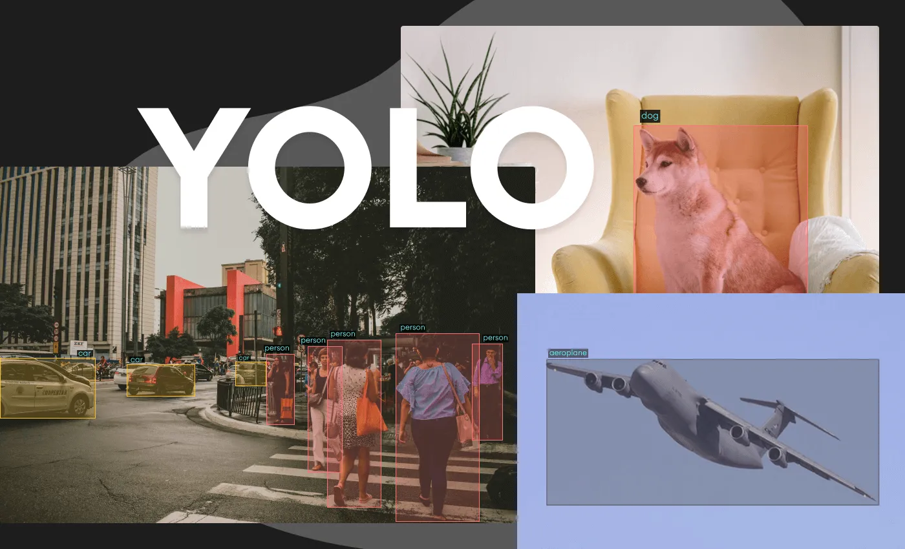

# 🏠 Indoor Object Detection Project

## 🌟 Overview
This project involves implementing an indoor object detection system using the YOLOv8 model. The goal is to detect and classify objects within indoor environments with state-of-the-art deep learning techniques.

**Supervised by:** *The Islamia University of Bahawalpur*  
**Technologies:** FastAPI (API), Streamlit (Frontend)

---

## 📂 Dataset
- **Structure:** Training, Validation, and Test Sets.
- **Classes:**  
  🚪 Door, 🚪 Cabinet Door, 🧊 Refrigerator Door, 🪟 Window, 🪑 Chair, 🛋️ Table, 🗄️ Cabinet, 🛋️ Couch, 🚪 Opened Door, 🏗️ Pole

---

## 🤖 Model
- **Architecture:** YOLOv8 Medium
- **Features:** Pre-trained weights, hyperparameter tuning, mAP metrics.

---

## 🛠️ Pipeline
### 📊 Data Visualization
- View labeled bounding boxes on images.

### 🎯 Model Training
- Configured using `yolo.yaml` with parameters:
  - Epochs: 160, Batch Size: 16, Learning Rate: 0.0003.

### 📈 Evaluation
- mAP @ 0.5:0.95, Recall, F1-Score.

### 🔍 Inference
- Test images with bounding box visualization.

---

## 🚀 Deployment
- **🌐 FastAPI**: API for predictions.
- **🖥️ Streamlit**: User interface for uploading and visualizing results.

---

## 📊 Results
- Metrics:
  - mAP @ 0.5:0.95: **[value]**
  - Recall: **[value]**
  - F1-Score: **[value]**

---

## 🏫 Supervision
This project is supervised by **The Islamia University of Bahawalpur**.

---

## 🙏 Acknowledgments
Special thanks to **The Islamia University of Bahawalpur** for their guidance.
